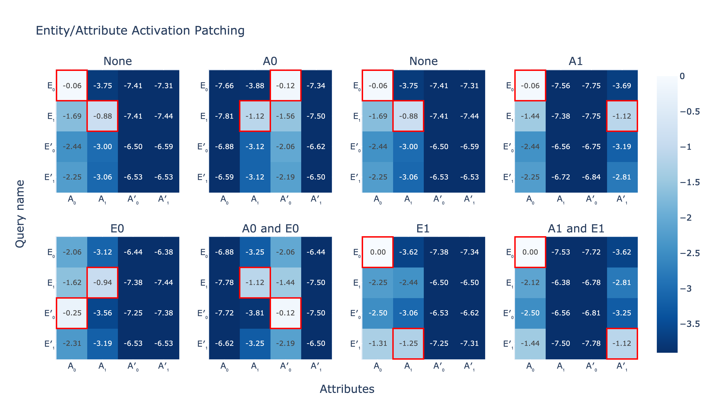
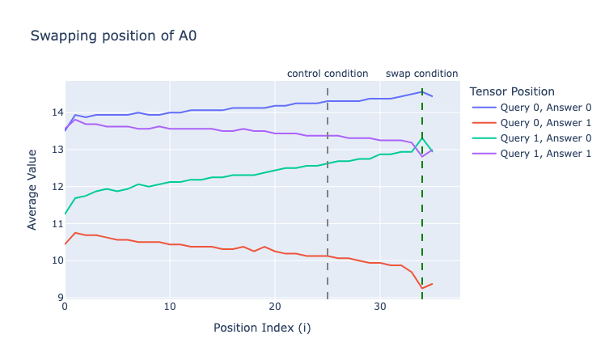
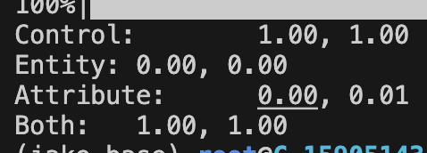

# Results

## Figure 3: Factorizability

*Pythia-1B*

## Figure 4: Position Intervention Experiments

TODO: explanation

*Pythia-1B*

*Pythia-1B*

## Mean Interventions
Table 1:

*Gemma-2-27b -- I found that this experiment didn't really work with smaller models -- maybe because they're using a different binding mechanism, or maybe because they're bad at knowing capitals in the first place.*

It seems like kind of a weird choice to use accuract here -- I think the results look worse if you use logits instead (TODO?)