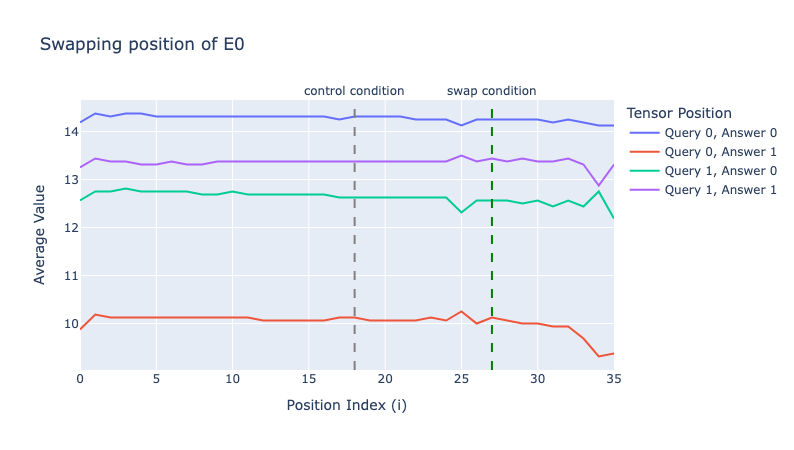

# Reproduction of "How do Language Models Bind Entities in Context?"
https://arxiv.org/abs/2310.17191

The authors find that related entities and attributes (eg `Alice (entity) lives in Munich (attribute)`) are bound together by adding binding ID vectors to each entity and each attribute. So, the activations for Alice contain `entity_binding_vector_0` and the activations for Munich contain `attribute_binding_vector_0`.
Across different contexts, `entity_binding_vector_0` etc. is always the same, regardless of the position of the relationship or the contents of the entity. The binding ID is only dependent on how many relationships appear (ie the first relationship always has ID 0, the second ID 1, etc) according to the paper.

# Results

## Figure 3: Factorizability
If we swap activations in the same position from one context to another, how does this affect model beliefs?

*Pythia-1B*

## Figure 4: Position Intervention Experiments

If we intervene on positional encodings _after_ activations are computed, how does this affect model beliefs?

*Pythia-1B*

*Pythia-1B*

One thing I noticed is that the model seems to separately encode absolute positional information (this methodology would not affect these encodings), so I'm not sure if this experiment is meaningful...

## Mean Interventions
If we compute the mean activation for all entities/attributes at some position, we can use this to try to directly intervene on binding vectors. This seems to work:

Table 1:

*Gemma-2-27b -- I found that this experiment didn't really work with smaller models -- maybe because they're using a different binding mechanism, or maybe because they're bad at knowing capitals in the first place.*

Using accuracy here instead of eg logits seems like it's not telling the full story
